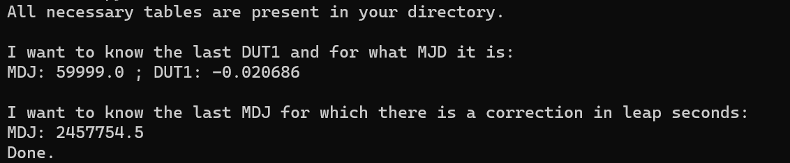

# PracticalAstro_TimeTables
This repository has been done by Mar Munuera and can be used to download and read the time conversion tables for Assignment 1 of Practical Astrodynamics

It should be noted that this code only returns the data from the correction tables but does not show how to search for this data and how to use it.


## How to use the code:
This is a fairly simple code. 
It is located in main.py and contains 5 functions: 2 that download the tables, one that checks if the tables are in the directory and 2 other that read the information from the tables.

## Example of use:

This code can be used from CLI commands, and does not require any inputs, as it can be seen below:

```
python main.py
```
This would be the output obtained in the console:



## Functions and their outputs

- get_table_correction_UT1(): 
    - This function saves the most recent table to carry out the UT1-UTC conversion
    - It saves automatically a file "finals.daily.txt" in the directory

- get_table_correction_GPS(): 
    - This function saves the most recent table to carry out the leap seconds correction
    - It saves automatically a file "leapSecondsTable.daily.txt" in the directory

- check_for_Tables(): 
    - This function calls checks if the tables are available in the directory and calls "get_table_correction_UT1()" or "get_table_correction_GPS()" if they aren't.

- get_DUT1(): 
    - This function reads the file "finals.daily.txt"
    - It returns the lists with floats: MJD (containing the Modified Julian Dates), DUT1 (containing the correction). 

- get_TAI_UTC(): 
    - This function reads the file "leapSecondsTable.txt"
    - It returns the lists with floats: MJD (containing the Modified Julian Dates) and TAI_UTC_1, TAI_UTC_2,TAI_UTC_3 (containing the corrections). 


